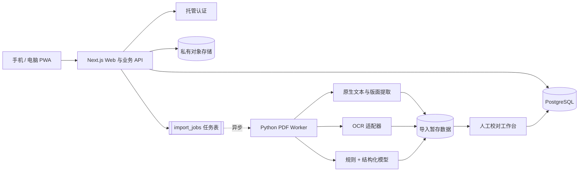
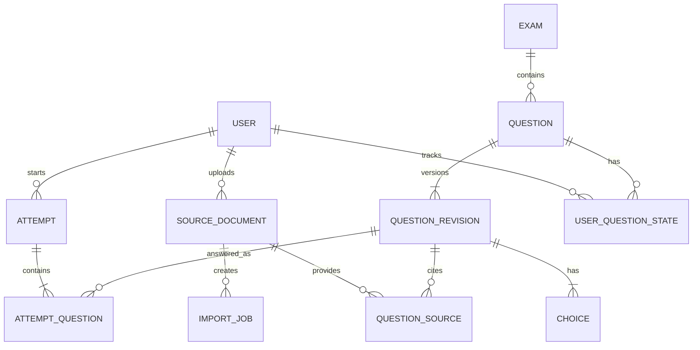

# 系统架构

## 决策摘要

采用“响应式 PWA + 模块化 Web 后端 + 独立 PDF Worker”的结构。MVP 保持少服务，题量或用户量增加后再把任务表替换为专用队列。

## 组件职责

| 组件 | 职责 | 边界 |
| --- | --- | --- |
| Next.js PWA | 页面、练习状态、题库管理、服务端 API | 不执行耗时 OCR |
| PostgreSQL | 题目版本、答题历史、复习状态、任务状态 | 不存大体积 PDF |
| 对象存储 | 私有 PDF、页图、题目图片、导出文件 | 仅短时签名访问 |
| Python Worker | PDF 预检、提取、OCR、结构化、校验 | 低权限隔离运行 |
| OCR 适配器 | 扫描页和复杂版面识别 | 可替换供应商 |
| 校对工作台 | 对照原页修正、确认和发布 | 人工是发布门禁 |

## 数据模型

关键实体：

- `source_documents`：文件哈希、拥有者、页数、解析器版本和存储位置。
- `import_jobs`：阶段、进度、幂等键、重试次数和错误摘要。
- `questions`：稳定 ID、考试、题型、发布状态和当前修订。
- `question_revisions`：题干、解析、正确答案、内容版本和审核记录。
- `question_sources`：页码、归一化坐标、原文和提取器。
- `attempts/attempt_questions`：练习会话和不可变作答事实。
- `user_question_states`：错题次数、连续答对、收藏和下次复习时间。

## 离线与同步

首版只离线缓存应用外壳和用户主动下载的题包。IndexedDB 保存题包版本、未提交作答事件和同步游标。

作答事件携带客户端生成的 `event_id`，服务端幂等写入：答题历史只追加；收藏使用最后写入优先；笔记发生版本冲突时保留两版。Service Worker 不缓存登录响应和短时文件 URL。

## 安全与隐私

- 每份 PDF 和题库都有 `owner_id`，数据库启用行级权限。
- PDF 存储桶默认私有，通过短时签名 URL 访问。
- PDF 解析容器禁止执行嵌入 JavaScript、附件和外部链接，并限制 CPU、内存、时间与网络。
- 富文本按白名单渲染，防止题干中的脚本注入。
- 日志不记录完整题干、答案、令牌或 PDF 内容。
- 上传、导入、发布、删除和角色变化保留审计记录。
- 删除先软删除并提供恢复期；数据库定期备份并演练恢复。

## 部署演进

MVP 可以使用托管 PostgreSQL、认证和对象存储降低运维量；Web 与 Worker 分别部署。规模增大后，依次引入专用消息队列、独立 API、缓存和更细的服务隔离，而不改变题目及导入数据契约。

