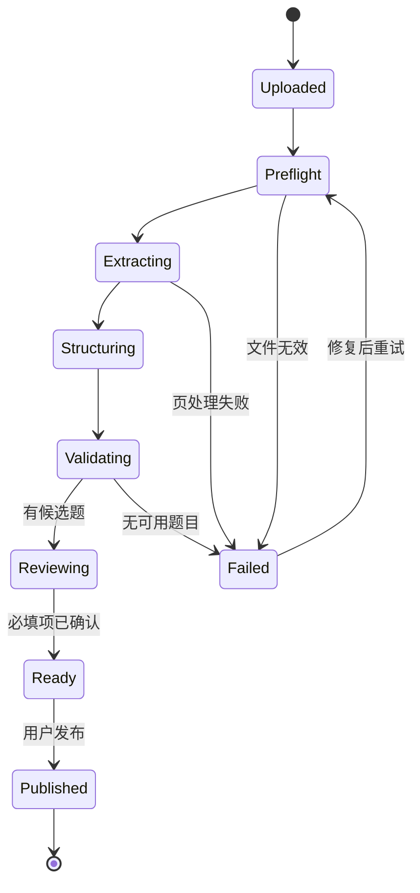

# PDF 导入与题目数据契约

## 导入原则

机器负责生成候选，人负责发布。任何结构化字段必须能追溯到原 PDF 页码、边界框和原始文本；低置信度或相互冲突的答案不能自动发布。



每个阶段保存输入哈希、处理器版本和输出，必须可幂等重跑到单页或单题。

## 处理步骤

1. 预检：真实 MIME、加密/损坏、页数、语言、SHA-256 去重和使用权确认。
2. 页面分类：`native_text`、`scanned` 或 `mixed`。
3. 双通道提取：原生字符及坐标；扫描区域渲染后 OCR。
4. 版面处理：去页眉页脚、水印，识别双栏、表格、图片与阅读顺序。
5. 题目切分：规则优先识别题号、选项、答案和解析，模型只处理模糊结构。
6. 跨页重组：题干、选项、解析和图片关系均保留 `source_spans`。
7. 确定性校验：答案引用、选项数量、题型约束、题号跳跃、重复题和资源完整性。
8. 人工校对：合并/拆分题目，编辑内容，确认低置信度字段。
9. 版本化发布：练习引用不可变修订版。

Azure Document Intelligence Layout 能返回文字、表格、选择标记、章节结构、页面坐标和置信度，可用于扫描件或复杂版面；文本 PDF 仍优先本地读取，避免不必要的费用与误差。

## 题目 JSON 契约

```json
{
  "schema_version": "1.0",
  "question_id": "uuid",
  "bank_id": "uuid",
  "exam_code": "AZ-104",
  "source_document_id": "uuid",
  "source_question_no": "42",
  "type": "single_choice",
  "status": "needs_review",
  "stem": {
    "raw": "source text",
    "display": "normalized Markdown",
    "confidence": 0.96,
    "reviewed": false
  },
  "options": [
    {
      "id": "uuid",
      "label": "A",
      "raw": "source option",
      "display": "source option",
      "confidence": 0.98,
      "reviewed": false
    }
  ],
  "correct_option_ids": ["uuid"],
  "answer_confidence": 0.93,
  "explanation": {
    "raw": "source explanation",
    "display": "normalized explanation",
    "confidence": 0.88,
    "reviewed": false
  },
  "assets": [
    {
      "asset_id": "uuid",
      "kind": "question_image",
      "storage_key": "questions/.../image.webp",
      "source_page": 12,
      "bbox": [0.12, 0.31, 0.86, 0.66],
      "sha256": "hex"
    }
  ],
  "source_spans": [
    {
      "page": 12,
      "bbox": [0.08, 0.12, 0.91, 0.89],
      "extractor": "pdf_text",
      "text": "source evidence",
      "confidence": 0.96
    }
  ],
  "quality": {
    "overall_confidence": 0.91,
    "flags": ["explanation_low_confidence"]
  },
  "content_version": 1
}
```

MVP 的 `type` 为 `single_choice`、`multiple_choice`、`true_false`；其他类型先记录为 `unknown` 或图片题并强制审核。

## 置信度与发布门槛

分别计算题目边界、题干、每个选项、答案、解析、图片关系和跨页合并的置信度，并记录原因码，例如 `ocr_unclear`、`answer_option_missing`、`cross_page_merge`。

- `>= 0.95`：所有规则通过时可批量接受普通字段。
- `0.80–0.95`：需要人工抽检；答案字段仍需确认。
- `< 0.80`：强制逐字段确认。
- 答案冲突、跨页合并、图片关系不确定：不受总分影响，一律强制审核。

校对台必须支持原页对照、字段高亮、快捷键、合并/拆分、图片关联、冲突提示和单页重跑。

