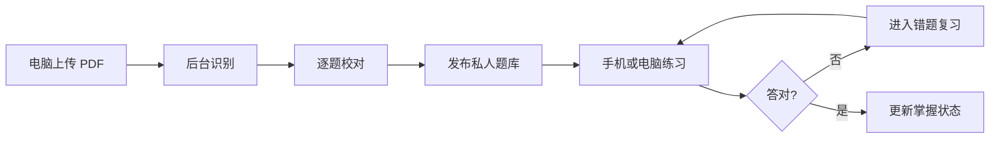

# 产品蓝图

## 产品定位

AZ Exam Coach 是私人备考工具，不是公开题库市场。它让用户在电脑上导入和校对 PDF，在手机或电脑上刷题、模拟考试和复习错题，并保证每道发布题都能追溯到原 PDF 页。

产品早期最重要的指标是：用户能否成功把一份 PDF 转成题库，并完成第一次练习。

## 核心用户旅程

## MVP 范围

| 能力 | MVP 行为 | 暂不包含 |
| --- | --- | --- |
| 账号 | 邮箱登录、跨设备同步 | 组织、会员、社交 |
| PDF | 上传、异步识别、逐题校对、失败重试 | 自动抓取第三方题库 |
| 题型 | 单选、多选、判断、带图选择题 | 拖拽、热点的完整交互 |
| 练习 | 顺序、随机、错题、收藏 | AI 实时讲题 |
| 模考 | 计时、交卷后判分 | 完整模拟官方实验题 |
| 统计 | AZ-104/AZ-305 分开统计，首次正确率和练习记录 | 通过概率预测 |
| 数据 | 私人题库、JSON 导出、软删除 | 公开分享市场 |

## 主要页面

1. 登录与注册。
2. 首页：继续练习、今日进度、薄弱标签。
3. 题库：上传、导入状态、题目数量与异常数量。
4. 校对工作台：左侧原页，右侧结构化题目。
5. 普通练习：选择、确认、答案与解析、收藏。
6. 模拟考试：倒计时、题号导航、统一交卷。
7. 错题与收藏。
8. 学习统计。
9. 设置与数据导出。

手机端使用底部导航和固定操作按钮；批量导入、双栏校对优先在电脑端完成。

## 题目状态与规则

题目状态为 `draft → needs_review → approved → published → archived`。

- 未确认题目绝不进入练习。
- 题干、至少两个选项和正确答案是发布必填项。
- 单选必须恰有一个答案；多选采用完整集合匹配。
- 答题确认前不显示答案；确认后锁定本次作答并展示解析。
- 历史作答绑定题目修订版，题目改答案后不篡改旧成绩。
- 错题之后连续答对两次，可自动进入“已掌握”，用户仍可手动调整。

## 验收标准

### 导入

- 支持文本型、扫描型与混合 PDF。
- 处理状态、失败原因和失败页码可见。
- 每道题都能打开来源页或来源裁切图。
- 用户可修改题干、选项、题型、答案、解析和图片关联。
- 页面刷新或任务重试不会产生重复题目。
- 100 页以内的导入在后台执行，不阻塞网站其他操作。

### 做题

- 单选只能选一项，多选可选多项且必须主动确认。
- 每次确认可靠保存；刷新或换设备后可恢复进度。
- 模考交卷前不泄露答案，计时结束自动交卷。
- 手机常见宽度下无需横向滚动，图片可放大。
- 键盘可操作，状态不只依靠颜色表达。

### 统计

- AZ-104 和 AZ-305 分开统计。
- 首页默认展示首次作答正确率，并明确统计口径。
- 错题、收藏、未做和知识标签均可筛选。
- 题目修订不会破坏历史记录。

## 后续阶段

- 阶段 2：OCR 自动化、相似题去重、来源区域高亮、批量纠错。
- 阶段 3：间隔复习、薄弱知识点组卷、中英文术语、案例题组。
- 阶段 4：更完整的审计、监控、备份恢复和受控分享。

