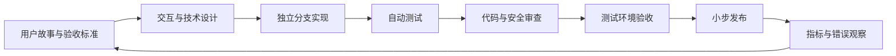

# 团队协作与 agent 工作流

## 角色

用户担任 Product Owner，决定产品优先级和验收真实使用效果；Codex 担任 Tech Lead，维护方案、拆解任务、集成代码并组织验收。

| 角色 | 主要产出 | 完成定义 |
| --- | --- | --- |
| 产品 Agent | 用户故事、页面流程、验收标准 | 边界与异常已写清 |
| UX Agent | 手机/电脑交互、状态与视觉规范 | 关键状态可点击验证 |
| 前端 Agent | 页面、PWA、离线事件 | 自动测试通过且响应式 |
| 后端 Agent | API、权限、题目版本、统计 | 契约与迁移测试通过 |
| PDF Agent | 提取器、OCR、结构化与来源证据 | 黄金样本回归通过 |
| QA Agent | 测试计划、自动化、缺陷复验 | 验收结果可复现 |
| 安全 Agent | 文件隔离、权限、隐私和依赖检查 | 无阻断级风险 |
| Claude Code | 独立实现或第二审查者 | 只处理明确任务包 |

## 功能交付流程



PDF 相关任务在自动测试之后额外执行黄金样本回归；数据库任务在合并前额外执行迁移检查。

## 标准任务包

任何交给 agent 或 Claude Code 的任务都必须包含以下内容，避免不同实现者对目标产生不同理解：

```text
任务：<一个可独立完成的结果>
背景：<对应用户场景和已有设计链接>
范围：<允许修改的目录与文件>
不做：<明确排除项>
验收：<可观察的通过条件>
测试：<必须新增/执行的测试>
接口：<输入、输出、Schema、错误码>
注意：不得修改 sources/；保留用户已有改动。
交付：实现摘要、改动文件、测试结果、遗留风险。
```

Claude Code 适合处理边界清晰的实现或独立审查，例如“按已批准 Schema 实现题目编辑表单”或“只审查导入 Worker 的幂等性”。不要让两个 agent 同时修改同一批文件；并行工作按 `web`、`worker`、`database`、`tests` 等目录隔离。

## 决策与变更管理

- 产品范围变化写入产品蓝图和 backlog。
- 架构或数据契约变化先记录决策理由、兼容方式和迁移方案。
- 题目 Schema、导入状态机和答案判定属于共享契约，修改前由 Tech Lead 审核。
- 发现缺陷时先补回归测试，再修复；真实 PDF 错误加入黄金样本。
- 每个迭代结束演示一条真实用户旅程，而不是只汇报代码数量。

## 每周节奏

- 周初：确定一个可演示目标，拆成独立任务包。
- 开发中：agent 并行实现，Tech Lead 维护共享契约和集成。
- 合并前：测试、审查、数据库/PDF 专项门禁。
- 周末：使用真实 PDF 和手机完成验收，记录下一轮问题。

